# ImgZipView 사용 설명서

> 보고 · 편집 · 압축까지 — 가볍고 광고 없는 이미지 뷰어 & 편집·압축 도구

이 문서는 ImgZipView의 모든 기능을 화면과 함께 안내합니다.

---

## 목차
1. [시작하기 — 이미지 불러오기](#1-시작하기--이미지-불러오기)
2. [지원 이미지 포맷](#2-지원-이미지-포맷)
3. [보기 — 그리드 · 자세히 · 단독뷰](#3-보기--그리드--자세히--단독뷰)
4. [촬영 정보(EXIF) 보기](#4-촬영-정보exif-보기)
5. [선택하기](#5-선택하기)
6. [편집 (자르기 · 회전 · 반전 · 보정 · 크기 · 포맷)](#6-편집)
7. [용량 줄이기 (압축)](#7-용량-줄이기-압축)
8. [워터마크](#8-워터마크)
9. [웹페이지 캡처](#9-웹페이지-캡처)
10. [파일 관리 & 일괄 처리](#10-파일-관리--일괄-처리)
11. [화면 환경 — 테마 · 배경 · 전체화면 · 핀](#11-화면-환경)
12. [단축키 모음](#12-단축키-모음)
13. [설치 / 빌드](#13-설치--빌드)

---

## 1. 시작하기 — 이미지 불러오기

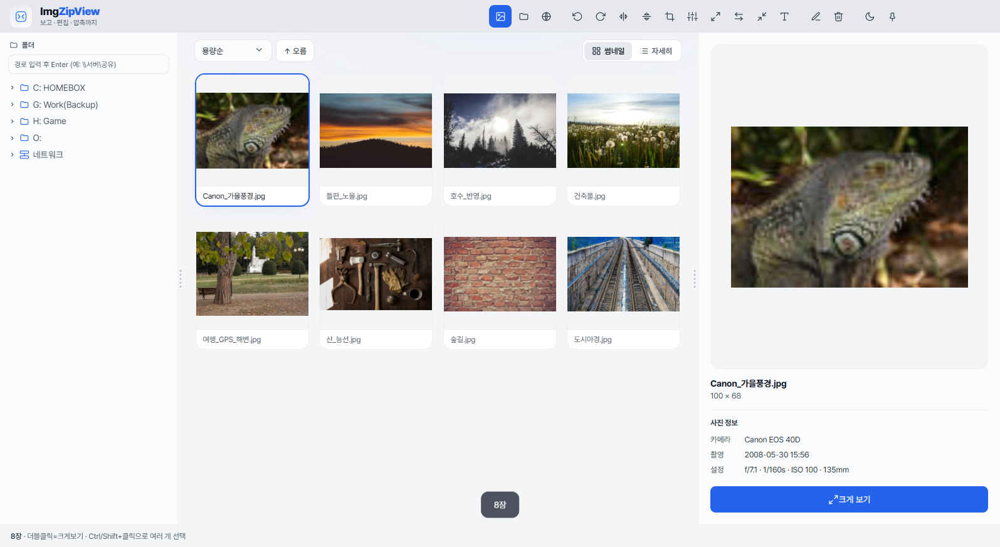

화면은 **좌측 폴더 트리 · 가운데 썸네일 · 우측 미리보기**의 3단 구조입니다. 상단 **툴바는 아이콘으로만** 표시되어 보는 영역을 넓게 쓰며, **아이콘에 마우스를 올리면 기능 이름이 툴팁**으로 나타납니다(이 설명서의 "○○ 버튼"은 해당 아이콘을 가리킵니다). 창 상단 타이틀바도 앱과 한 몸으로 통합되어 있습니다.

이미지를 불러오는 방법은 여러 가지입니다.

- **열기** — 상단 `열기` 버튼으로 이미지 파일을 직접 선택(여러 장 가능).
- **폴더** — `폴더` 버튼으로 폴더를 통째로 열기.
- **폴더 트리** — 왼쪽에서 드라이브 → 폴더를 펼쳐 클릭하면 그 폴더의 이미지가 바로 로드됩니다.
  - **네트워크/NAS** — `네트워크` 노드에서 SMB 컴퓨터(예: `\\HBnas`)와 공유 폴더까지 탐색합니다. 경로 입력칸에 `\\서버\공유`를 직접 입력해도 됩니다.
  - 이미지와 하위 폴더가 함께 있는 폴더는, 상단에 **폴더 카드**가 먼저 표시되어 더블클릭으로 안으로 들어갈 수 있습니다.
- **드래그앤드롭** — 탐색기에서 이미지나 폴더를 끌어다 놓으면 바로 열립니다.
- **웹 캡처** — 웹페이지를 캡처해 바로 목록에 추가합니다([9번 참고](#9-웹페이지-캡처)).

> 폴더를 열 때 이미지를 미리 다 읽지 않고 **지연 로딩**하므로, 수천 장이 든 폴더도 즉시 열립니다. 좌우 사이드바 경계의 **점(⋮) 그립**을 드래그하면 너비를 조절할 수 있고(더블클릭=초기화), 가운데 보는 영역을 더 넓힐 수 있습니다.

---

## 2. 지원 이미지 포맷

뷰어로 바로 볼 수 있는 확장자입니다.

| 분류 | 확장자 |
|---|---|
| 일반 | **JPG / JPEG · PNG · WebP · GIF · BMP · SVG · ICO** |
| 고해상도/특수 | **TIFF · TIF** (내장 디코더) |
| 휴대폰 사진 | **HEIC · HEIF** (아이폰 등, 내장 디코더) |
| 작업 파일 | **PSD** (포토샵, 합성 미리보기) |

> TIFF·HEIC·PSD는 브라우저가 기본 지원하지 않아 **내장 디코더로 변환해 표시**합니다. 드물게 디코드에 실패하면 "디코드 실패" 표시가 나타납니다.
> Figma `.fig`는 독점 포맷이라 지원하지 않습니다(Figma에서 PNG/PDF로 내보내 보세요).

---

## 3. 보기 — 그리드 · 자세히 · 단독뷰

### 썸네일 / 자세히
우측 상단 토글로 **썸네일(바둑판)**과 **자세히(목록)**를 전환합니다. 자세히 보기는 이름·크기·**DPI**·용량·생성일을 한눈에 보여주며, 상단 **정렬**(이름·날짜·용량·해상도, 오름/내림)을 바꿀 수 있습니다. 정렬 설정은 저장됩니다.

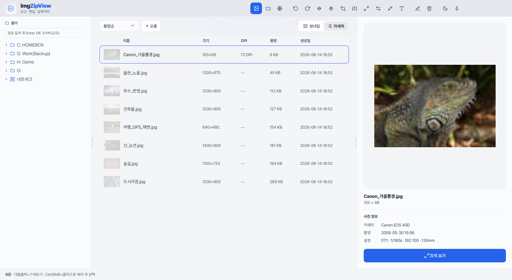

### 단독 크게보기
이미지를 **더블클릭**(또는 `Enter`)하면 단독 뷰로 크게 봅니다.

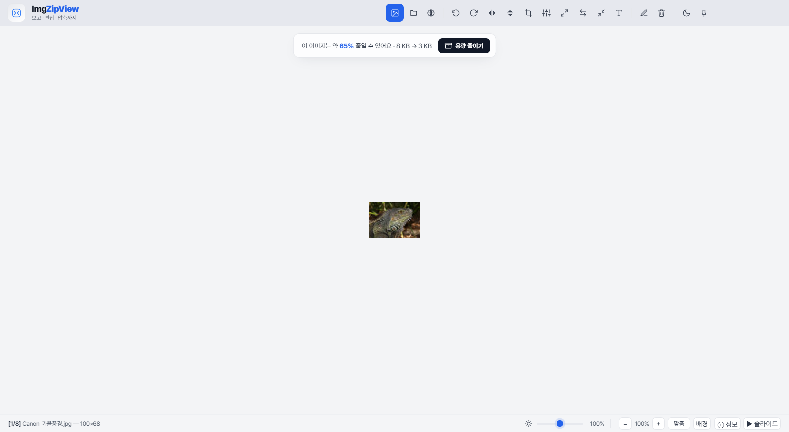

- **이전/다음** — `←` `→`, `Space`/`Backspace`, 또는 마우스 **휠**.
- **확대/축소** — `Ctrl+휠`, `+`/`-`, `0`(창 맞춤) / `1`(원본 100%).
- **이동(팬)** — 확대 상태에서 드래그.
- 하단 바에서 **밝기 슬라이더 · 창 맞춤 · 배경색 · ▶슬라이드쇼 · ⓘ정보**를 사용할 수 있습니다.
- `목록` 버튼 또는 `Esc`로 그리드로 돌아옵니다.

---

## 4. 촬영 정보(EXIF) 보기

사진의 촬영 정보를 자동으로 읽어 보여줍니다 — **카메라 · 촬영 일시 · 설정(조리개 f값·셔터속도·ISO·초점거리) · 렌즈 · GPS 위치**.

- **그리드** — 이미지를 선택하면 우측 미리보기 패널 아래에 "사진 정보"가 표시됩니다.

  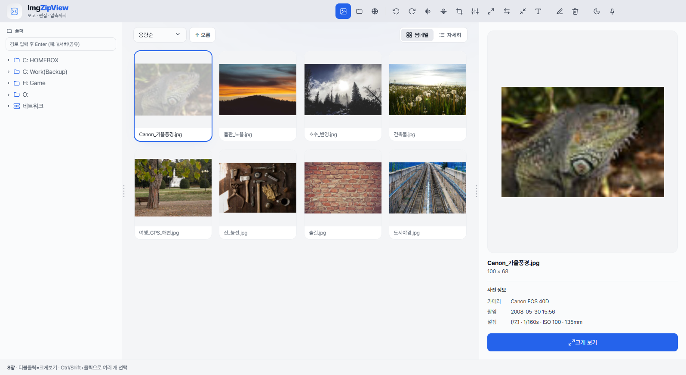

- **단독뷰** — 하단 `ⓘ 정보` 버튼을 누르면 이미지 위에 정보 오버레이가 뜹니다. 사진을 넘기면 자동 갱신됩니다. GPS가 있으면 **지도** 링크로 위치를 열 수 있습니다.

  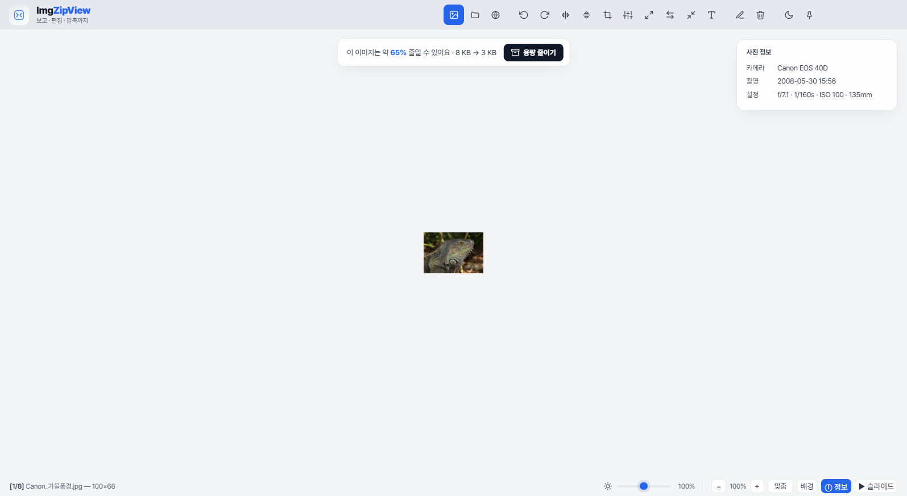

---

## 5. 선택하기

여러 장을 한 번에 처리하려면 먼저 선택합니다.

- **클릭** — 한 장 선택(우측 미리보기 표시).
- **Ctrl+클릭** — 개별 추가/해제, **Shift+클릭** — 범위 선택.
- **드래그 박스** — 빈 곳이나 타일 위를 드래그하면 박스에 닿는 이미지가 한꺼번에 선택됩니다.
- **Ctrl+A** — 전체 선택.
- **우클릭** — 선택 이미지에 대한 메뉴(크게보기 · 자르기 · 크기변경 · 회전 · 반전 · 보정 · 용량줄이기 · 포맷변환 · 이름변경 · 인쇄 · 탐색기에서 보기 · 삭제). 확대뷰에서도 동일하게 동작합니다.

---

## 6. 편집

선택한 이미지(여러 장이면 **일괄**)에 적용됩니다. 모든 파괴적 편집은 원본을 같은 폴더의 **`ImgZipView_원본/`** 에 자동 백업합니다.

| 기능 | 설명 |
|---|---|
| **자르기(크롭)** | 전용 화면에서 드래그로 영역 선택 후 적용 |
| **회전 / 반전** | 좌·우 90° 회전, 좌우/상하 반전 |
| **밝기·대비·채도 보정** | 실시간 미리보기 슬라이더 |
| **크기변경** | 비율(%) · 해상도(가로×세로) · 긴 축(px) |
| **포맷변환** | JPG · PNG · WebP · BMP · **PDF** |

### 자르기

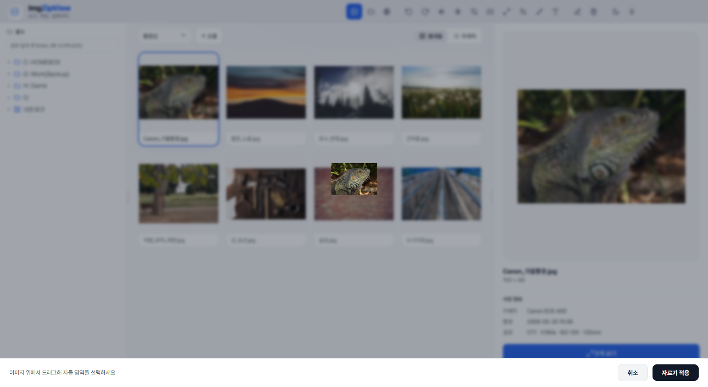

이미지 위를 드래그해 자를 영역을 선택하고 `자르기 적용`을 누릅니다.

### 보정 (밝기·대비·채도)

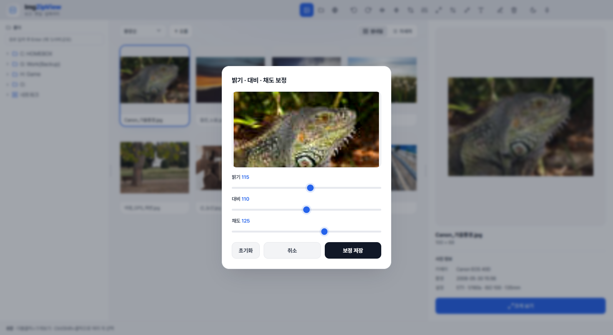

슬라이더를 움직이면 미리보기에 즉시 반영됩니다.

### 크기변경

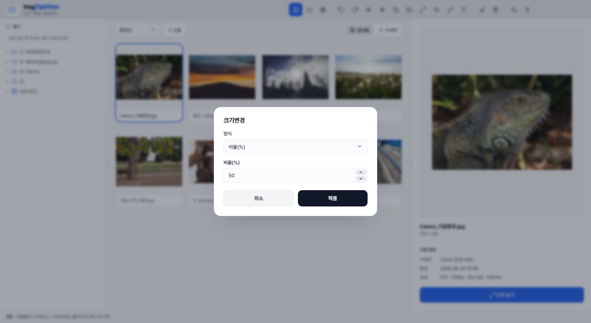

### 포맷변환 (PDF 포함)

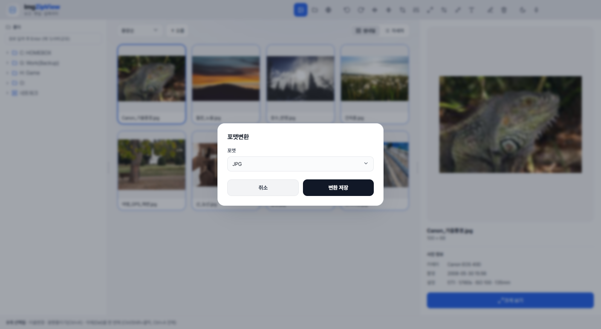

`PDF`를 고르면 선택한 **여러 장을 한 PDF의 여러 페이지**로 저장합니다. 웹 캡처본을 PDF로 만들 때도 유용합니다.

---

## 7. 용량 줄이기 (압축)

선택한 이미지들을 한 번에 압축합니다.

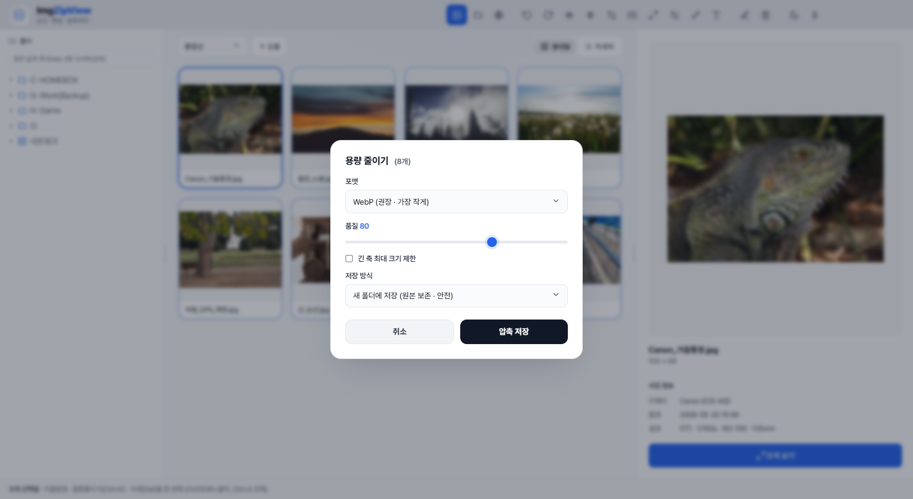

- **포맷** — WebP(권장) / JPG / 원본 유지 / PNG
- **품질** · **긴 축 최대 크기 제한**
- **저장 방식** — 새 폴더에 저장(원본 보존) 또는 원본 덮어쓰기(원본은 백업)

단독뷰 상단의 "이 이미지는 약 N% 줄일 수 있어요" 바에서도 바로 이 기능을 열 수 있습니다.

---

## 8. 워터마크

선택한 이미지에 워터마크를 합성합니다(일괄 적용).

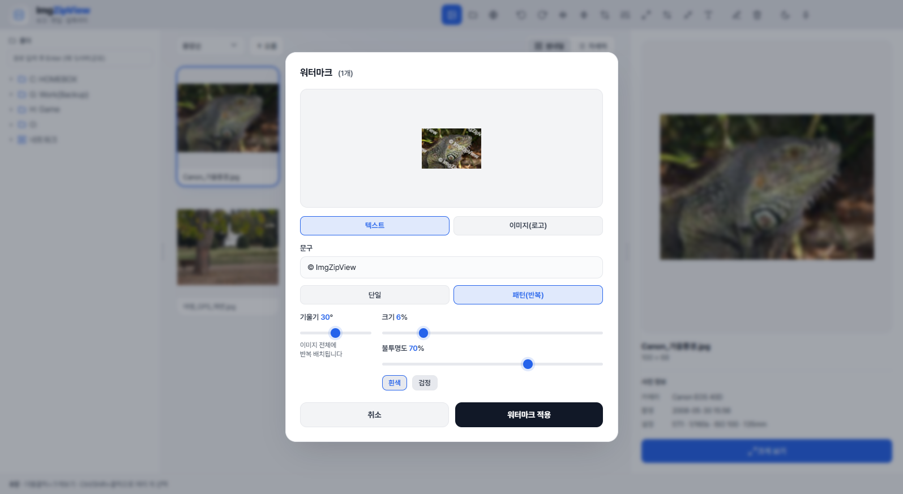

- **종류** — 텍스트, 또는 **이미지(PNG 로고)** 업로드.
- **배치** — **단일**(9분할 위치) 또는 **패턴(반복)** — 이미지 전체에 반복 배치(기울기 0~60°).
- 크기 · 불투명도 · 색(흰/검)을 조절하며 미리보기로 확인합니다.

> 로고가 잘 안 보이면 크기를 키우거나, 어두운 사진엔 밝은 로고를 사용하세요.

---

## 9. 웹페이지 캡처

주소만 입력하면 웹페이지를 캡처해 목록에 추가합니다.

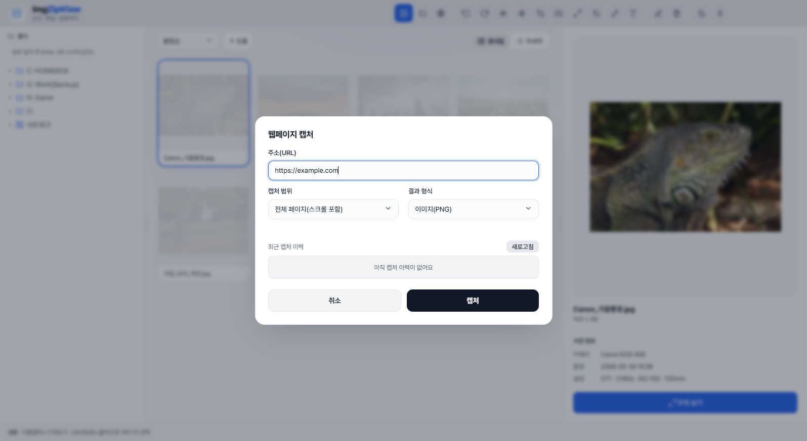

- **캡처 범위** — 전체 페이지(스크롤 포함) 또는 보이는 영역.
- **결과 형식** — 이미지(PNG) 또는 **PDF**.
- **최근 캡처 이력** — 과거 캡처가 목록으로 남아, 클릭하면 캐시 파일을 다시 불러옵니다.

캡처한 이미지는 바로 목록에 들어오므로, 이어서 자르기·압축·워터마크 등 편집을 할 수 있습니다. 저장 위치는 `다운로드\ImgZipView_Captures\` 입니다.

---

## 10. 파일 관리 & 일괄 처리

- **이름변경** — 한 장, 또는 여러 장을 **규칙(번호·날짜·시간 변수)**으로 일괄 변경.
- **삭제** — 휴지통으로 이동(여러 장 한 번에).
- **일괄 처리** — 크기변경 · 포맷변환 · 압축 · 워터마크 · 이름변경 · 삭제는 모두 **선택한 여러 장에 한 번에** 적용됩니다.
- **인쇄** — 우클릭 메뉴 또는 단독뷰 `Ctrl+P`.
- **탐색기에서 보기** — 우클릭으로 파일 위치 열기.

---

## 11. 화면 환경

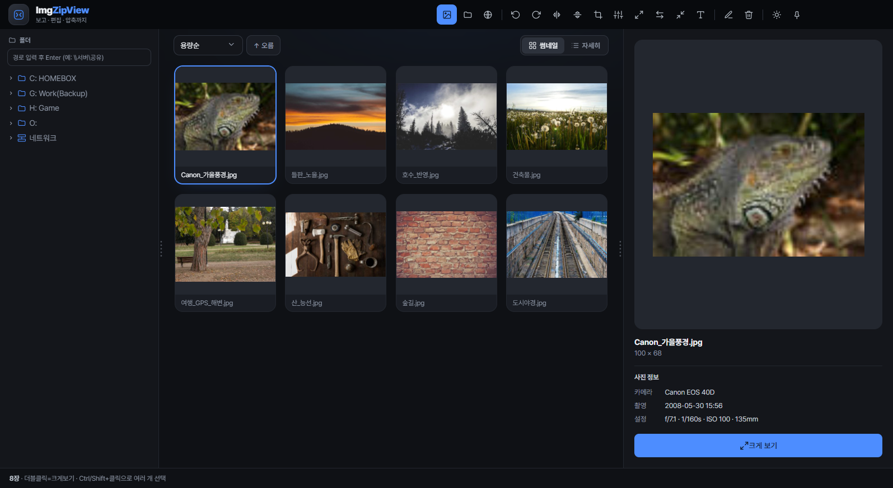

- **테마** — 상단 우측 해/달 버튼으로 **라이트 ↔ 다크** 전환(저장됨).
- **뷰어 배경** — 단독뷰 `배경` 버튼으로 테마기본 / 밝은회색 / 흰색 / 검정 / **체크무늬**(투명 확인용) 순환.
- **전체화면** — `F11`.
- **항상 위에(핀)** — 상단 우측 📌 버튼으로 창을 항상 위에 고정.
- **슬라이드쇼** — 단독뷰에서 `S` 또는 `▶ 슬라이드`.

---

## 12. 단축키 모음

| 키 / 마우스 | 기능 | 키 / 마우스 | 기능 |
|---|---|---|---|
| `←` `→` · `Space` `Backspace` | 이전/다음 | `Home` `End` | 처음/마지막 |
| `휠`(단독뷰) | 이전/다음 | `Ctrl+휠` · `+` `-` | 확대/축소 |
| `0` / `1` | 창 맞춤 / 원본 100% | `F11` | 전체화면 |
| `S` | 슬라이드쇼 | `Ctrl+P` | 인쇄 |
| 확대 후 **드래그** | 이미지 이동(팬) | `Del` / `F2` | 삭제 / 이름변경 |
| `Ctrl+.` / `Ctrl+,` | 오른쪽/왼쪽 회전 | `Ctrl+R` `Ctrl+E` `Ctrl+K` | 크기변경 / 포맷변환 / 용량줄이기 |
| 그리드 **드래그** | 박스 선택 | `Ctrl+A` | 전체 선택 |
| `Esc` `Enter` | 목록으로 | 이미지 **더블클릭** | 크게보기/목록 |

---

## 13. 설치 / 빌드

설치본(`ImgZipView-Install-<버전>.exe`)을 실행하면 한국어 설치 마법사로 설치됩니다. 개발/빌드는:

```bash
npm install
npm start          # 개발 실행
npm run dist       # Windows 설치본 빌드
```

> 모든 처리는 PC 내부(로컬)에서만 이루어집니다. 광고 없음.
